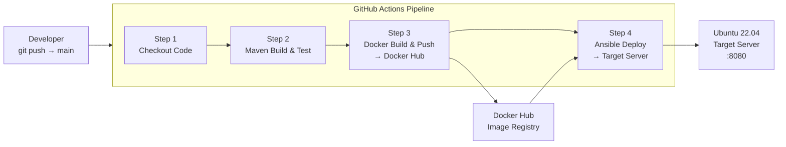

# Design Document: Automated Java Delivery Pipeline

## Overview

This project implements a fully automated CI/CD pipeline for a Spring Boot Java web application. A developer pushes code to the `main` branch on GitHub; from that point forward, GitHub Actions orchestrates the entire flow: Maven builds and tests the app, Docker packages it into a container image and pushes it to Docker Hub, and Ansible SSHes into the target Ubuntu 22.04 server to pull and run the new image — no manual steps required.

The application itself is intentionally minimal (a single "Hello, Pipeline!" endpoint) so the focus stays on the pipeline infrastructure.

---

## Architecture



### Flow Summary

1. Developer pushes to `main`
2. GitHub Actions triggers the workflow
3. Maven compiles, tests, and packages the app into a `.jar`
4. Docker builds a multi-stage image, tags it with `latest` and the commit SHA, and pushes to Docker Hub
5. Ansible connects to the target server via SSH, pulls the new image, replaces the running container, and verifies it is healthy
6. The application is live at `http://YOUR_SERVER_IP:8080`

---

## Components and Interfaces

### 1. Java Application (`src/`)

- Framework: Spring Boot 3.x (embedded Tomcat, no external servlet container needed)
- Single `@RestController` mapped to `GET /` returning `"Hello, Pipeline!"`
- Standard Maven layout: `src/main/java`, `src/main/resources`, `src/test/java`
- Packaged as an executable `.jar` via `spring-boot-maven-plugin`

### 2. Maven Build (`pom.xml` + Maven Wrapper)

- Java 17 source/target compatibility
- Dependencies: `spring-boot-starter-web`, `spring-boot-starter-test`
- Plugin: `spring-boot-maven-plugin` for executable JAR packaging
- Maven Wrapper (`.mvn/wrapper/`, `mvnw`, `mvnw.cmd`) so no local Maven install is required
- Build lifecycle: `clean → compile → test → package`

### 3. Multi-Stage Dockerfile

```
Stage 1 (builder)          Stage 2 (runtime)
─────────────────          ─────────────────
maven:3.9-eclipse-         eclipse-temurin:17-jre-alpine
temurin-17
  COPY pom.xml               COPY --from=builder /app/target/*.jar app.jar
  COPY src/                  RUN addgroup/adduser (non-root)
  RUN mvn package            USER appuser
                             EXPOSE 8080
                             HEALTHCHECK ...
                             ENTRYPOINT ["java","-jar","app.jar"]
```

- Stage 1 uses `maven:3.9-eclipse-temurin-17` — includes both Maven and JDK
- Stage 2 uses `eclipse-temurin:17-jre-alpine` — minimal JRE only (~85 MB vs ~500 MB)
- Non-root user `appuser` created in Stage 2 for security
- `HEALTHCHECK` polls `http://localhost:8080/` every 30s with a 5s timeout

### 4. Ansible (`ansible/`)

```
ansible/
├── deploy.yml          # Main playbook
└── inventory/
    └── hosts.ini       # Target host definition
```

- `hosts.ini` defines a `[webservers]` group with `YOUR_SERVER_IP` and `ansible_ssh_private_key_file`
- `deploy.yml` tasks (in order):
  1. Pull latest image: `community.docker.docker_image` (or `docker pull` shell task)
  2. Stop & remove existing container: `community.docker.docker_container` with `state: absent`
  3. Start new container: `community.docker.docker_container` with `state: started`, port mapping `8080:8080`
  4. Verify: `community.docker.docker_container_info` + `assert` that `State.Running == true`
- Ansible variables: `docker_image`, `container_name`, `host_port`, `container_port`

### 5. GitHub Actions Workflow (`.github/workflows/pipeline.yml`)

```
Trigger: push to main

Jobs:
└── build-and-deploy (ubuntu-latest)
    ├── actions/checkout@v4
    ├── actions/setup-java@v4  (Java 17, distribution: temurin)
    ├── mvn clean package -B
    ├── docker/login-action@v3  (DOCKERHUB_USERNAME / DOCKERHUB_TOKEN secrets)
    ├── docker build + push  (tags: latest, ${{ github.sha }})
    ├── Install Ansible (pip install ansible)
    ├── Write SSH key from secret to ~/.ssh/id_rsa
    └── ansible-playbook ansible/deploy.yml -i ansible/inventory/hosts.ini
```

Secrets required:
| Secret | Purpose |
|---|---|
| `DOCKERHUB_USERNAME` | Docker Hub login username |
| `DOCKERHUB_TOKEN` | Docker Hub access token (not password) |
| `SSH_PRIVATE_KEY` | Private key to SSH into the target server |
| `TARGET_SERVER_IP` | IP of the deployment target (used in hosts.ini or passed as extra-var) |

---

## Data Models

This pipeline has no application-level data models — the Spring Boot app is stateless and returns a static string. The relevant "data" is configuration:

- **Docker image tag**: `YOUR_DOCKERHUB_USERNAME/java-pipeline-app:latest` and `:${{ github.sha }}`
- **Container name**: `java-pipeline-app` (used by Ansible to identify the running container)
- **Port mapping**: host `8080` → container `8080`

---

## Error Handling

| Failure Point | Behavior |
|---|---|
| Maven test failure | Build step exits non-zero; workflow stops; no image is built or pushed |
| Docker build failure | Docker step exits non-zero; workflow stops; no push or deploy |
| Docker push failure | Push step exits non-zero; workflow stops; Ansible does not run |
| Ansible SSH failure | Ansible exits non-zero; workflow marks job as failed |
| Container fails to start | Ansible `assert` task fails; playbook reports error and exits non-zero |
| Existing container not found | Ansible `docker_container` with `state: absent` is idempotent — no error if container doesn't exist |

GitHub Actions propagates non-zero exit codes from all steps, so any failure in the chain stops the pipeline and marks the run red.

---

## Testing Strategy

### Unit Tests (Maven / JUnit 5)
- `HelloControllerTest` uses Spring Boot's `@WebMvcTest` to verify:
  - `GET /` returns HTTP 200
  - Response body equals `"Hello, Pipeline!"`
- Tests run automatically during `mvn clean package` (Surefire plugin)
- A failing test blocks the entire pipeline

### Integration / Smoke Test (Ansible)
- After container start, Ansible asserts `State.Running == true`
- This acts as a lightweight post-deploy smoke test

### Local Testing
- Developers can run `./mvnw spring-boot:run` to test locally on port 8080
- Developers can run `docker build -t java-pipeline-app . && docker run -p 8080:8080 java-pipeline-app` to test the Docker image locally before pushing

---

## Project Folder Structure

```
java-pipeline-project/
├── .github/
│   └── workflows/
│       └── pipeline.yml          # GitHub Actions CI/CD workflow
├── .mvn/
│   └── wrapper/
│       └── maven-wrapper.properties
├── ansible/
│   ├── deploy.yml                # Ansible deployment playbook
│   └── inventory/
│       └── hosts.ini             # Target server inventory
├── src/
│   ├── main/
│   │   ├── java/
│   │   │   └── com/example/pipeline/
│   │   │       ├── PipelineApplication.java
│   │   │       └── HelloController.java
│   │   └── resources/
│   │       └── application.properties
│   └── test/
│       └── java/
│           └── com/example/pipeline/
│               └── HelloControllerTest.java
├── Dockerfile
├── mvnw                          # Maven wrapper (Unix)
├── mvnw.cmd                      # Maven wrapper (Windows)
├── pom.xml
└── README.md
```
